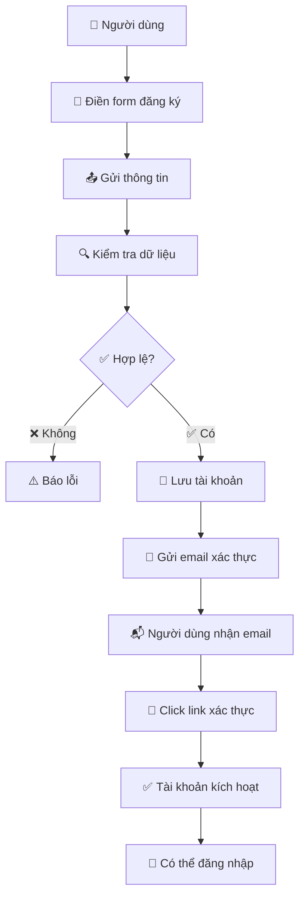
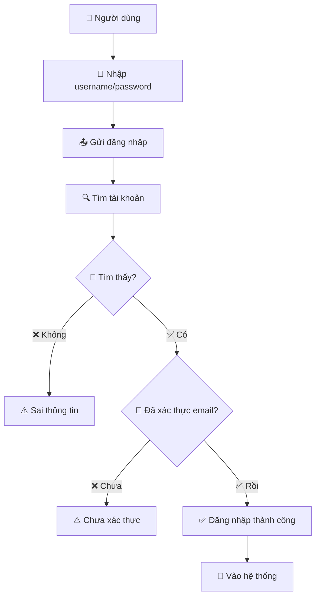
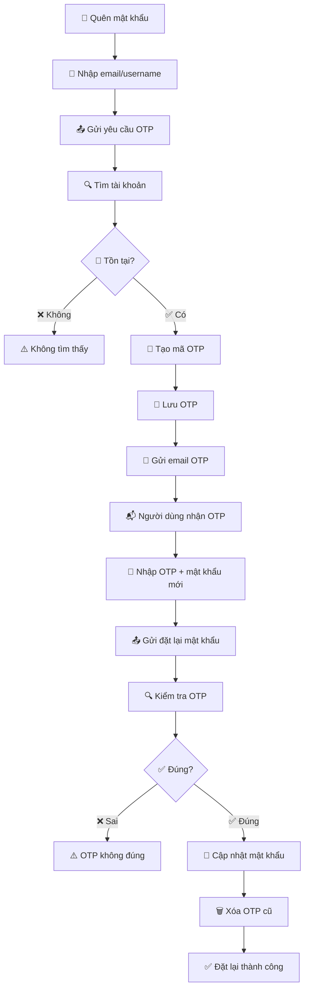
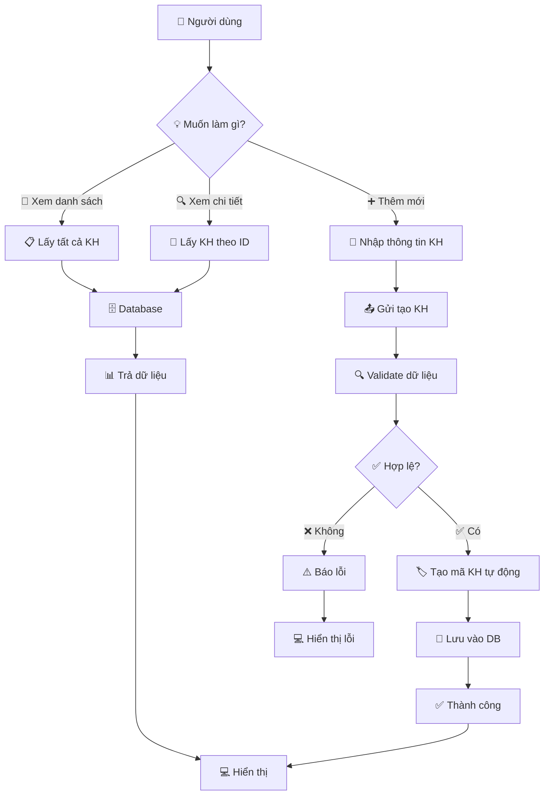
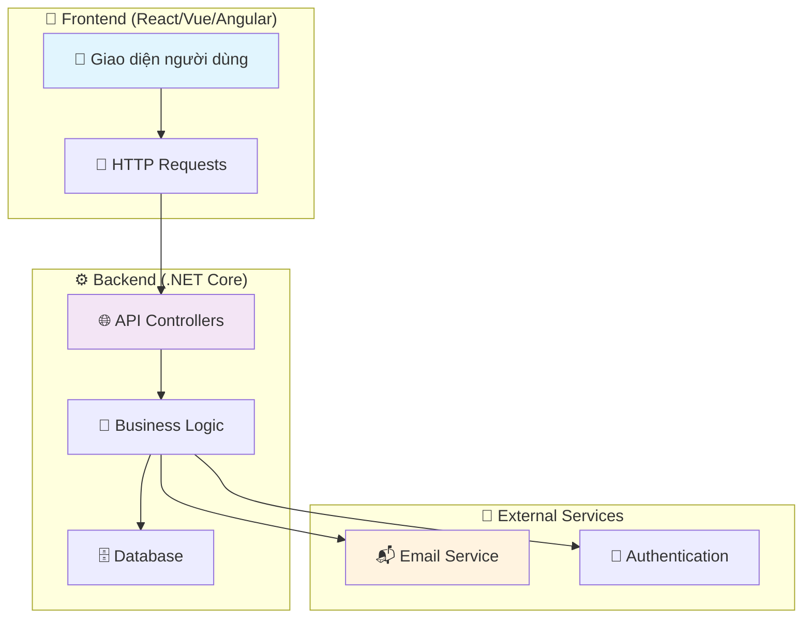

# Hướng dẫn quản lý Khách hàng và Tài khoản

## Tổng quan

Module này bao gồm các API quản lý thông tin khách hàng và hệ thống tài khoản người dùng.

## 1. KhachHang API - Quản lý khách hàng

### Các endpoint chính

#### 1.1 Lấy danh sách tất cả khách hàng

**GET** `/api/KhachHang`

**Response (thành công):**
```json
{
  "status": 0,
  "message": "Success",
  "data": [
    {
      "makh": "KH001",
      "hoten": "Nguyễn Văn A",
      "ngaysinh": "1990-01-01T00:00:00",
      "sodt": "0123456789",
      "diachi": "123 Đường ABC, Quận 1, TP.HCM"
    }
  ]
}
```

#### 1.2 Lấy thông tin khách hàng theo mã

**GET** `/api/KhachHang/{maKhachHang}`

#### 1.3 Tạo khách hàng mới

**POST** `/api/KhachHang`

**Request Body:**
```json
{
  "hoten": "Nguyễn Văn B",
  "ngaysinh": "1995-05-15T00:00:00",
  "sodt": "0987654321",
  "diachi": "456 Đường XYZ, Quận 2, TP.HCM"
}
```

## 2. TaiKhoan API - Quản lý tài khoản

### Các endpoint chính

#### 2.1 Lấy danh sách tất cả tài khoản

**GET** `/api/TaiKhoan`

#### 2.2 Kiểm tra tên đăng nhập

**GET** `/api/TaiKhoan/CheckUsername?username={username}`

#### 2.3 Đăng ký tài khoản

**POST** `/api/TaiKhoan`

**Request Body:**
```json
{
  "tenDangNhap": "newuser",
  "matKhau": "password123",
  "email": "newuser@example.com"
}
```

#### 2.4 Xác thực email

**GET** `/api/TaiKhoan/ConfirmEmail?token={token}`

#### 2.5 Đăng nhập

**POST** `/api/TaiKhoan/Login`

**Request Body:**
```json
{
  "tenDangNhap": "user1",
  "matKhau": "password123"
}
```

#### 2.6 Gửi OTP quên mật khẩu

**POST** `/api/TaiKhoan/SendOtp`

**Request Body:**
```json
{
  "tenDangNhap": "user1",
  "email": "user1@example.com"
}
```

#### 2.7 Đặt lại mật khẩu

**POST** `/api/TaiKhoan/ResetPassword`

**Request Body:**
```json
{
  "tenDangNhap": "user1",
  "email": "user1@example.com",
  "otp": 123456,
  "matKhauMoi": "newpassword123"
}
```

## Luồng sử dụng

### Đăng ký tài khoản:
1. POST `/api/TaiKhoan` - Tạo tài khoản
2. Kiểm tra email và click link xác thực
3. GET `/api/TaiKhoan/ConfirmEmail` - Xác thực email
4. POST `/api/TaiKhoan/Login` - Đăng nhập

### Quên mật khẩu:
1. POST `/api/TaiKhoan/SendOtp` - Nhận OTP qua email
2. POST `/api/TaiKhoan/ResetPassword` - Đặt lại mật khẩu với OTP

## Flow Diagrams

### 1. 🎯 Luồng Đăng ký Tài khoản (Đơn giản)



### 2. 🔐 Luồng Đăng nhập



### 3. 🔑 Luồng Quên Mật khẩu



### 4. 👥 Luồng Quản lý Khách hàng



### 5. 📊 Tổng quan Tương tác API



## Ví dụ sử dụng từ frontend

### JavaScript / Fetch API

```javascript
// Đăng ký tài khoản
const registerData = {
  tenDangNhap: "newuser",
  matKhau: "password123",
  email: "newuser@example.com"
};

const registerResponse = await fetch('/api/TaiKhoan', {
  method: 'POST',
  headers: {
    'Content-Type': 'application/json'
  },
  body: JSON.stringify(registerData)
});

// Đăng nhập
const loginData = {
  tenDangNhap: "user1",
  matKhau: "password123"
};

const loginResponse = await fetch('/api/TaiKhoan/Login', {
  method: 'POST',
  headers: {
    'Content-Type': 'application/json'
  },
  body: JSON.stringify(loginData)
});

// Lấy danh sách khách hàng
const khachHangList = await fetch('/api/KhachHang');
const khachHangData = await khachHangList.json();

// Tạo khách hàng mới
const newKhachHang = {
  hoten: "Trần Thị C",
  ngaysinh: "1988-12-25T00:00:00",
  sodt: "0912345678",
  diachi: "789 Đường DEF, Quận 3, TP.HCM"
};

const createResponse = await fetch('/api/KhachHang', {
  method: 'POST',
  headers: {
    'Content-Type': 'application/json'
  },
  body: JSON.stringify(newKhachHang)
});
```

## Lưu ý kỹ thuật

### KhachHang API:
- Mã khách hàng (MAKH): Tự động generate khi tạo
- Ngày sinh: Format ISO 8601 (yyyy-MM-ddTHH:mm:ss)
- Số điện thoại: String, không bắt buộc unique
- Địa chỉ: Text field, có thể null

### TaiKhoan API:
- Email confirmation: Token được tạo ngẫu nhiên và gửi qua email
- OTP: 6 số, có hiệu lực 5 phút (không có timeout code trong controller)
- Password: Lưu plain text (không khuyến nghị cho production)
- MaTK: Tự động generate theo format TK0001, TK0002, etc.
- Email: Sử dụng Gmail SMTP (credentials hardcoded)

## Test API

### Sử dụng Swagger UI
1. Chạy: `dotnet run --launch-profile "https"`
2. Mở: `https://localhost:port/swagger`
3. Tìm endpoints trong `KhachHang` và `TaiKhoan`

### Sử dụng PowerShell

```powershell
# Đăng ký tài khoản
$body = @{
    tenDangNhap = "testuser"
    matKhau = "testpass"
    email = "test@example.com"
} | ConvertTo-Json

Invoke-WebRequest -Uri "https://localhost:5001/api/TaiKhoan" -Method POST -Body $body -ContentType "application/json" -SkipCertificateCheck

# Đăng nhập
$loginBody = @{
    tenDangNhap = "testuser"
    matKhau = "testpass"
} | ConvertTo-Json

Invoke-WebRequest -Uri "https://localhost:5001/api/TaiKhoan/Login" -Method POST -Body $loginBody -ContentType "application/json" -SkipCertificateCheck

# Lấy danh sách khách hàng
Invoke-WebRequest -Uri "https://localhost:5001/api/KhachHang" -Method GET -SkipCertificateCheck
```

## Hỗ trợ

Kiểm tra logs server nếu gặp lỗi. Đảm bảo:
- Email hợp lệ và có thể nhận mail
- Username chưa tồn tại khi đăng ký
- Tài khoản đã xác thực email trước khi đăng nhập
- OTP còn hiệu lực khi reset password
- Dữ liệu khách hàng hợp lệ