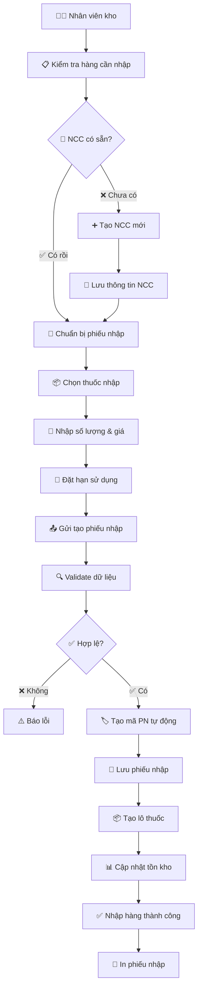
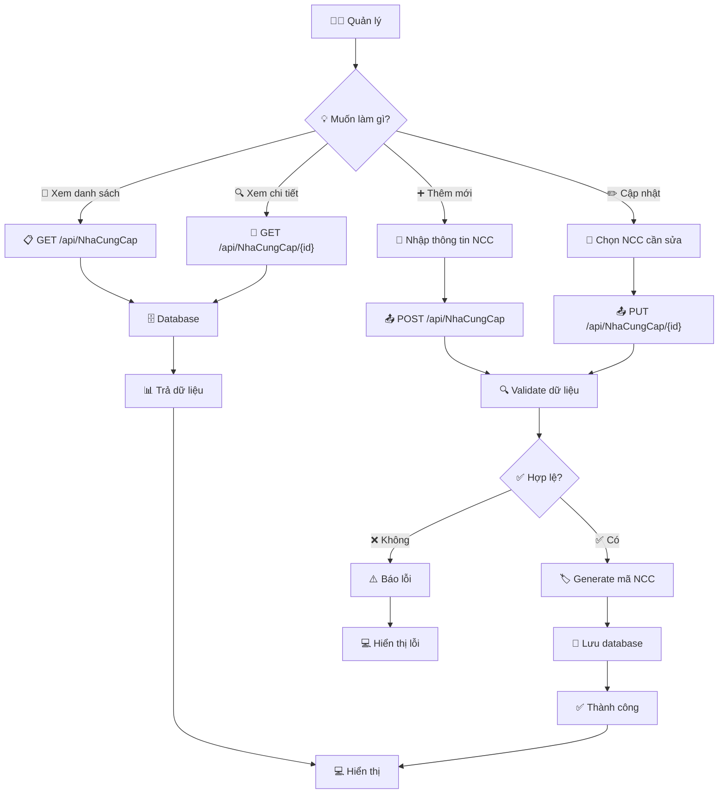
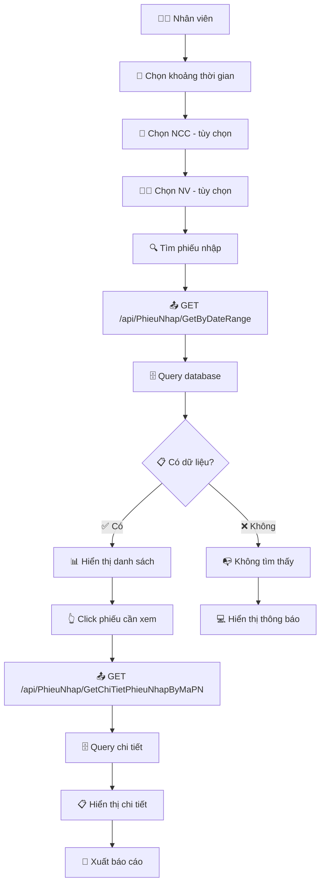
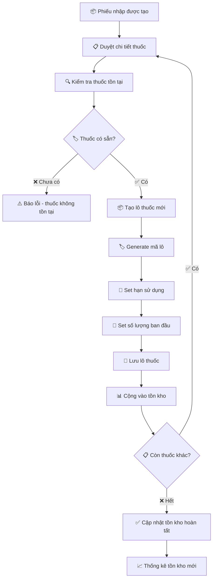
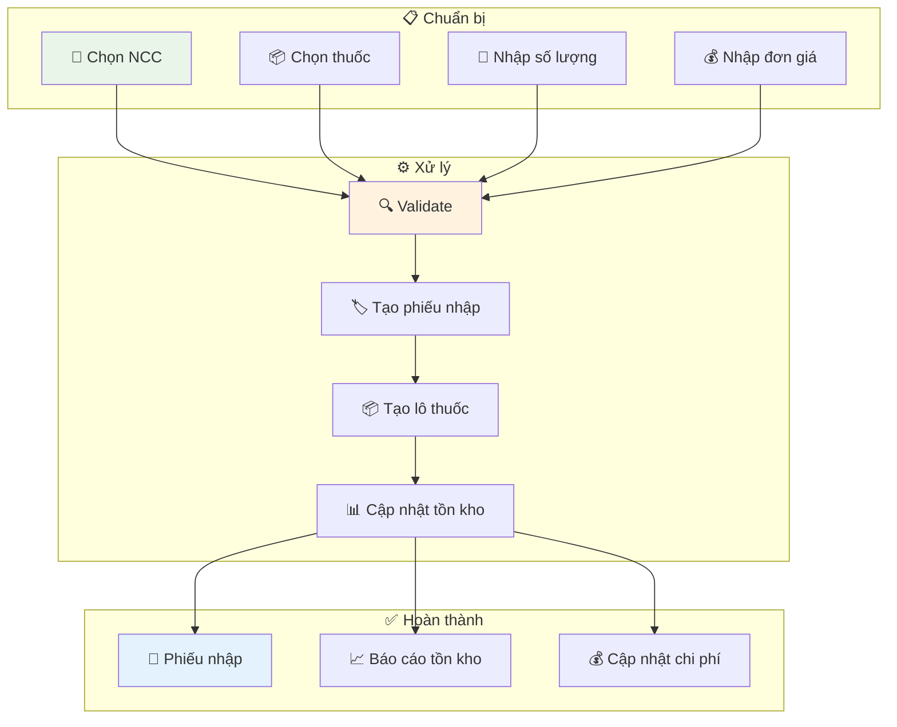

# Hướng dẫn quản lý Nhập hàng và Nhà cung cấp

## Tổng quan

Module này bao gồm các API quản lý phiếu nhập thuốc và thông tin nhà cung cấp.

## 1. PhieuNhap API - Quản lý phiếu nhập

### Các endpoint chính

#### 1.1 Lấy danh sách phiếu nhập theo khoảng thời gian

**GET** `/api/PhieuNhap/GetByDateRange`

**Query Parameters:**
- `startDate` (bắt buộc): Ngày bắt đầu
- `endDate` (bắt buộc): Ngày kết thúc
- `maNV` (tùy chọn): Mã nhân viên để lọc
- `maNCC` (tùy chọn): Mã nhà cung cấp để lọc

**Ví dụ:** `GET /api/PhieuNhap/GetByDateRange?startDate=2025-01-01&endDate=2025-12-31`

#### 1.2 Tạo phiếu nhập mới

**POST** `/api/PhieuNhap/AddPhieuNhap`

**Request Body:**
```json
{
  "maNV": "NV001",
  "maNCC": "NCC001",
  "ghiChu": "Nhập thuốc bổ sung",
  "chiTietPhieuNhaps": [
    {
      "maThuoc": "THUOC001",
      "soLuong": 100,
      "donGia": 15000,
      "hanSuDung": "2026-11-17",
      "maLD": "LD001"
    }
  ],
  "loThuocHSDs": [
    {
      "maThuoc": "THUOC001",
      "soLuong": 50,
      "hanSuDung": "2026-11-17",
      "maLD": "LD001"
    }
  ]
}
```

#### 1.3 Lấy chi tiết phiếu nhập

**GET** `/api/PhieuNhap/GetChiTietPhieuNhapByMaPN`

**Query Parameter:** `maPN` (bắt buộc)

**Ví dụ:** `GET /api/PhieuNhap/GetChiTietPhieuNhapByMaPN?maPN=PN20251117000001`

## 2. NhaCungCap API - Quản lý nhà cung cấp

### Các endpoint chính

#### 2.1 Lấy danh sách tất cả nhà cung cấp

**GET** `/api/NhaCungCap`

#### 2.2 Lấy thông tin nhà cung cấp theo mã

**GET** `/api/NhaCungCap/{id}`

#### 2.3 Tạo nhà cung cấp mới

**POST** `/api/NhaCungCap`

**Request Body:**
```json
{
  "tenNCC": "Công ty Dược phẩm XYZ",
  "diaChi": "456 Đường GHI, Quận 2, TP.HCM",
  "soDT": "0987654321",
  "email": "contact@xyz.com"
}
```

#### 2.4 Cập nhật thông tin nhà cung cấp

**PUT** `/api/NhaCungCap/{id}`

## Luồng nhập hàng

### Tạo phiếu nhập:
1. Chuẩn bị thông tin nhà cung cấp (hoặc tạo mới nếu chưa có)
2. Tạo phiếu nhập với danh sách thuốc và chi tiết
3. Hệ thống tự động tạo lô thuốc và cập nhật tồn kho

### Xem lịch sử nhập:
1. Lấy danh sách phiếu nhập theo khoảng thời gian
2. Xem chi tiết từng phiếu nhập

## Flow Diagrams

### 1. 📦 Luồng Nhập hàng (Đầy đủ)



### 2. 🏢 Luồng Quản lý Nhà cung cấp



### 3. 📊 Luồng Tra cứu Phiếu nhập



### 4. 🔄 Luồng Xử lý Tồn kho khi Nhập hàng



### 5. 📈 Tổng quan Quy trình Nhập hàng



## Ví dụ sử dụng từ frontend

### JavaScript / Fetch API

```javascript
// Lấy phiếu nhập theo khoảng thời gian
const phieuNhap = await fetch('/api/PhieuNhap/GetByDateRange?startDate=2025-01-01&endDate=2025-12-31');
const phieuNhapData = await phieuNhap.json();

// Tạo phiếu nhập mới
const newPhieuNhap = {
  maNV: "NV001",
  maNCC: "NCC001",
  ghiChu: "Nhập thuốc bổ sung",
  chiTietPhieuNhaps: [
    {
      maThuoc: "THUOC001",
      soLuong: 100,
      donGia: 15000,
      hanSuDung: "2026-11-17",
      maLD: "LD001"
    }
  ]
};

const createResponse = await fetch('/api/PhieuNhap/AddPhieuNhap', {
  method: 'POST',
  headers: {
    'Content-Type': 'application/json'
  },
  body: JSON.stringify(newPhieuNhap)
});

// Lấy danh sách nhà cung cấp
const nccList = await fetch('/api/NhaCungCap');
const nccData = await nccList.json();

// Tạo nhà cung cấp mới
const newNCC = {
  tenNCC: "Công ty Dược phẩm NEW",
  diaChi: "789 Đường JKL, Quận 3, TP.HCM",
  soDT: "0912345678",
  email: "contact@new.com"
};

const nccResponse = await fetch('/api/NhaCungCap', {
  method: 'POST',
  headers: {
    'Content-Type': 'application/json'
  },
  body: JSON.stringify(newNCC)
});
```

## Lưu ý kỹ thuật

### PhieuNhap API:
- Mã phiếu nhập: Tự động generate theo format PN + timestamp
- Tổng tiền: Tự động tính từ chiTietPhieuNhaps
- Lô thuốc: Tự động tạo nếu không cung cấp loThuocHSDs
- Validation: Kiểm tra maNV, maNCC, maThuoc tồn tại

### NhaCungCap API:
- Mã nhà cung cấp (maNCC): Tự động generate khi tạo
- Tên nhà cung cấp: Bắt buộc, không được null
- Địa chỉ, số điện thoại, email: Có thể null
- Validation: ModelState validation được áp dụng

## Test API

### Sử dụng Swagger UI
1. Chạy: `dotnet run --launch-profile "https"`
2. Mở: `https://localhost:port/swagger`
3. Tìm endpoints trong `PhieuNhap` và `NhaCungCap`

### Sử dụng PowerShell

```powershell
# Lấy phiếu nhập theo khoảng thời gian
Invoke-WebRequest -Uri "https://localhost:5001/api/PhieuNhap/GetByDateRange?startDate=2025-01-01&endDate=2025-12-31" -Method GET -SkipCertificateCheck

# Tạo phiếu nhập
$phieuNhapBody = @{
    maNV = "NV001"
    maNCC = "NCC001"
    ghiChu = "Test nhập"
    chiTietPhieuNhaps = @(
        @{
            maThuoc = "THUOC001"
            soLuong = 10
            donGia = 15000
            hanSuDung = "2026-12-31"
            maLD = "LD001"
        }
    )
} | ConvertTo-Json

Invoke-WebRequest -Uri "https://localhost:5001/api/PhieuNhap/AddPhieuNhap" -Method POST -Body $phieuNhapBody -ContentType "application/json" -SkipCertificateCheck

# Lấy danh sách nhà cung cấp
Invoke-WebRequest -Uri "https://localhost:5001/api/NhaCungCap" -Method GET -SkipCertificateCheck
```

## Hỗ trợ

Kiểm tra logs server nếu gặp lỗi. Đảm bảo:
- maNV, maNCC, maThuoc tồn tại trong hệ thống
- Ngày tháng đúng format
- Số lượng và đơn giá > 0
- HanSuDung là future date