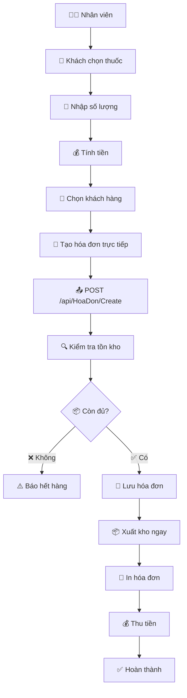
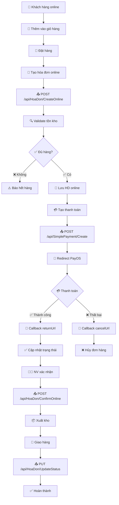
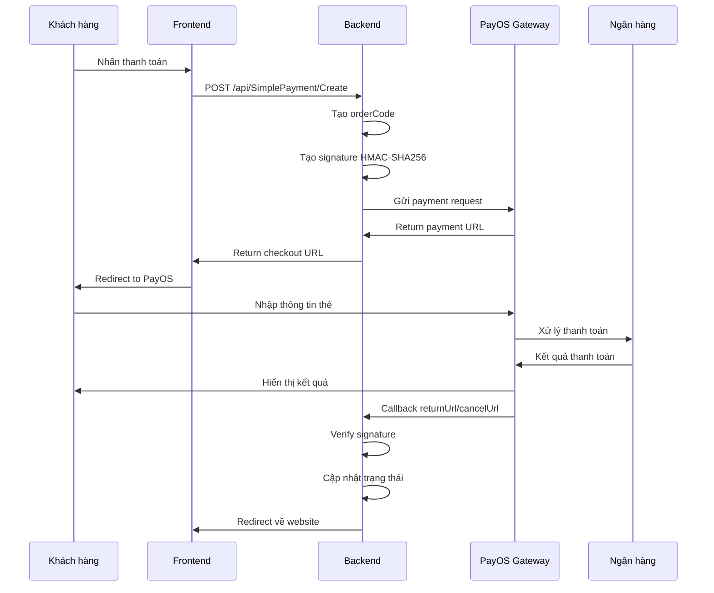
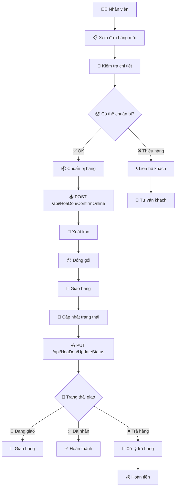
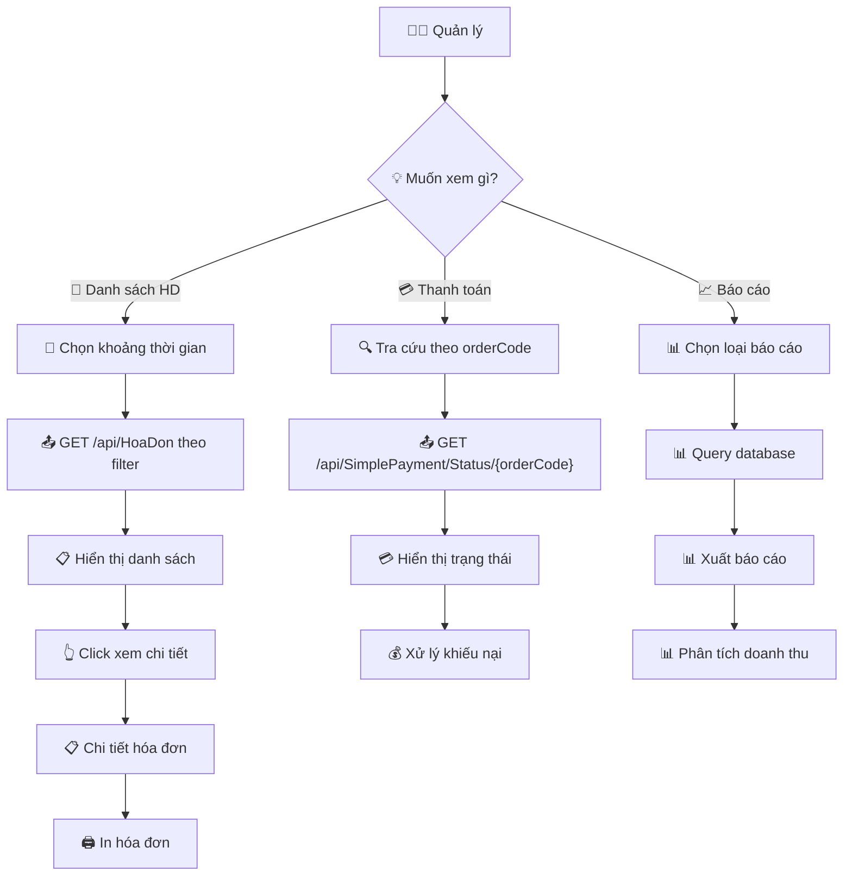
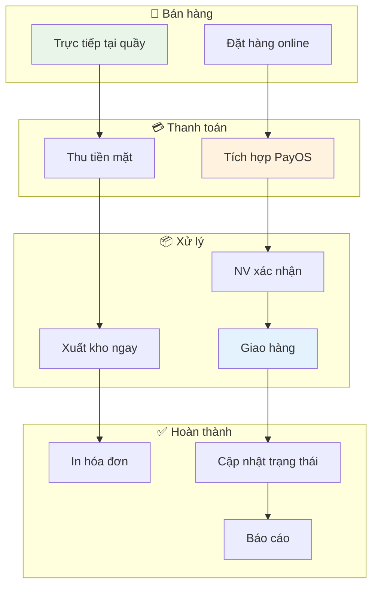

# Hướng dẫn quản lý Hóa đơn và Thanh toán

## Tổng quan

Module này bao gồm các API quản lý hóa đơn bán hàng và tích hợp thanh toán PayOS.

## 1. HoaDon API - Quản lý hóa đơn

### Các endpoint chính

#### 1.1 Tạo hóa đơn trực tiếp

**POST** `/api/HoaDon/Create`

**Request Body:**
```json
{
  "maKH": "KH001",
  "maNV": "NV001",
  "ghiChu": "Bán lẻ tại quầy",
  "tongTien": 150000,
  "items": [
    {
      "maThuoc": "THUOC001",
      "soLuong": 10,
      "donGia": 15000
    }
  ]
}
```

#### 1.2 Tạo hóa đơn online

**POST** `/api/HoaDon/CreateOnline`

**Request Body:**
```json
{
  "maKH": "KH001",
  "ghiChu": "Đặt hàng online",
  "tongTien": 150000,
  "items": [
    {
      "maThuoc": "THUOC001",
      "soLuong": 10,
      "donGia": 15000
    }
  ]
}
```

#### 1.3 Xác nhận hóa đơn online

**POST** `/api/HoaDon/ConfirmOnline`

**Request Body:**
```json
{
  "maHD": "HDOL20251117120000",
  "maNV": "NV001"
}
```

#### 1.4 Cập nhật trạng thái hóa đơn

**PUT** `/api/HoaDon/UpdateStatus`

**Request Body:**
```json
{
  "maHD": "HDOL20251117120000",
  "trangThaiGiaoHang": 1
}
```

## 2. PayOS API - Tích hợp thanh toán

### Các endpoint chính

#### 2.1 Tạo thanh toán

**POST** `/api/SimplePayment/Create`

**Request Body:**
```json
{
  "amount": 150000,
  "description": "Thanh toán hóa đơn HDOL20251117120000",
  "returnUrl": "https://yourapp.com/payment/success",
  "cancelUrl": "https://yourapp.com/payment/cancel"
}
```

#### 2.2 Kiểm tra trạng thái thanh toán

**GET** `/api/SimplePayment/Status/{orderCode}`

## Luồng hóa đơn online với thanh toán

### Quy trình đầy đủ:
1. **Thêm giỏ hàng** (xử lý trên frontend)
2. **Tạo hóa đơn online**: POST `/api/HoaDon/CreateOnline`
3. **Tạo thanh toán**: POST `/api/SimplePayment/Create`
4. **Thanh toán** (redirect đến PayOS)
5. **Xử lý kết quả**:
   - Thành công: returnUrl được gọi
   - Thất bại: cancelUrl được gọi
6. **Nhân viên xác nhận**: POST `/api/HoaDon/ConfirmOnline`
7. **Cập nhật trạng thái giao hàng**: PUT `/api/HoaDon/UpdateStatus`

### Các trạng thái giao hàng:
- 0: Chưa xử lý
- 1: Đang chuẩn bị
- 2: Đang giao
- 3: Đã nhận
- 4: Đã hủy

## Flow Diagrams

### 1. 🛒 Luồng Bán hàng tại Quầy



### 2. 🌐 Luồng Đặt hàng Online (Đầy đủ)



### 3. 💳 Luồng Thanh toán PayOS



### 4. 📦 Luồng Xử lý Đơn hàng bởi Nhân viên



### 5. 📊 Luồng Tra cứu và Báo cáo



### 6. 🔄 Tổng quan Quy trình Bán hàng



## Ví dụ sử dụng từ frontend

### JavaScript / Fetch API

```javascript
// Tạo hóa đơn trực tiếp
const hoaDonTrucTiep = {
  maKH: "KH001",
  maNV: "NV001",
  ghiChu: "Bán lẻ tại quầy",
  tongTien: 150000,
  items: [
    {
      maThuoc: "THUOC001",
      soLuong: 10,
      donGia: 15000
    }
  ]
};

const hdResponse = await fetch('/api/HoaDon/Create', {
  method: 'POST',
  headers: {
    'Content-Type': 'application/json'
  },
  body: JSON.stringify(hoaDonTrucTiep)
});

// Tạo hóa đơn online
const hoaDonOnline = {
  maKH: "KH001",
  ghiChu: "Đặt hàng online",
  tongTien: 150000,
  items: [
    {
      maThuoc: "THUOC001",
      soLuong: 10,
      donGia: 15000
    }
  ]
};

const hdolResponse = await fetch('/api/HoaDon/CreateOnline', {
  method: 'POST',
  headers: {
    'Content-Type': 'application/json'
  },
  body: JSON.stringify(hoaDonOnline)
});

// Tạo thanh toán PayOS
const paymentData = {
  amount: 150000,
  description: "Thanh toán hóa đơn",
  returnUrl: "https://yourapp.com/success",
  cancelUrl: "https://yourapp.com/cancel"
};

const paymentResponse = await fetch('/api/SimplePayment/Create', {
  method: 'POST',
  headers: {
    'Content-Type': 'application/json'
  },
  body: JSON.stringify(paymentData)
});

// Xác nhận hóa đơn online
const confirmData = {
  maHD: "HDOL20251117120000",
  maNV: "NV001"
};

const confirmResponse = await fetch('/api/HoaDon/ConfirmOnline', {
  method: 'POST',
  headers: {
    'Content-Type': 'application/json'
  },
  body: JSON.stringify(confirmData)
});

// Cập nhật trạng thái
const statusData = {
  maHD: "HDOL20251117120000",
  trangThaiGiaoHang: 2
};

const statusResponse = await fetch('/api/HoaDon/UpdateStatus', {
  method: 'PUT',
  headers: {
    'Content-Type': 'application/json'
  },
  body: JSON.stringify(statusData)
});
```

## Lưu ý kỹ thuật

### HoaDon API:
- Mã hóa đơn: HD (trực tiếp) / HDOL (online) + timestamp
- Xuất kho: Chỉ thực hiện khi ConfirmOnline hoặc Create trực tiếp
- Validation: Kiểm tra tồn kho trước khi tạo
- Tổng tiền: Tự động tính từ items

### PayOS API:
- HMAC-SHA256 signature validation
- ReturnUrl/CancelUrl: Cần HTTPS trong production
- OrderCode: Unique identifier cho mỗi thanh toán
- Amount: Đơn vị VND, không có dấu chấm

## Test API

### Sử dụng Swagger UI
1. Chạy: `dotnet run --launch-profile "https"`
2. Mở: `https://localhost:port/swagger`
3. Tìm endpoints trong `HoaDon` và `SimplePayment`

### Sử dụng PowerShell

```powershell
# Tạo hóa đơn trực tiếp
$hoaDonBody = @{
    maKH = "KH001"
    maNV = "NV001"
    ghiChu = "Test bán"
    tongTien = 150000
    items = @(
        @{
            maThuoc = "THUOC001"
            soLuong = 10
            donGia = 15000
        }
    )
} | ConvertTo-Json

Invoke-WebRequest -Uri "https://localhost:5001/api/HoaDon/Create" -Method POST -Body $hoaDonBody -ContentType "application/json" -SkipCertificateCheck

# Tạo thanh toán
$paymentBody = @{
    amount = 150000
    description = "Test payment"
    returnUrl = "https://example.com/success"
    cancelUrl = "https://example.com/cancel"
} | ConvertTo-Json

Invoke-WebRequest -Uri "https://localhost:5001/api/SimplePayment/Create" -Method POST -Body $paymentBody -ContentType "application/json" -SkipCertificateCheck
```

## Hỗ trợ

Kiểm tra logs server nếu gặp lỗi. Đảm bảo:
- Tồn kho đủ trước khi tạo hóa đơn
- maKH, maNV, maThuoc tồn tại
- Tổng tiền khớp với items
- PayOS credentials đúng
- URLs hợp lệ cho returnUrl/cancelUrl