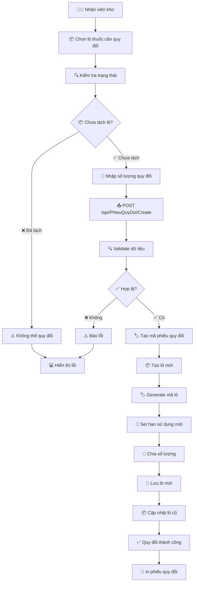
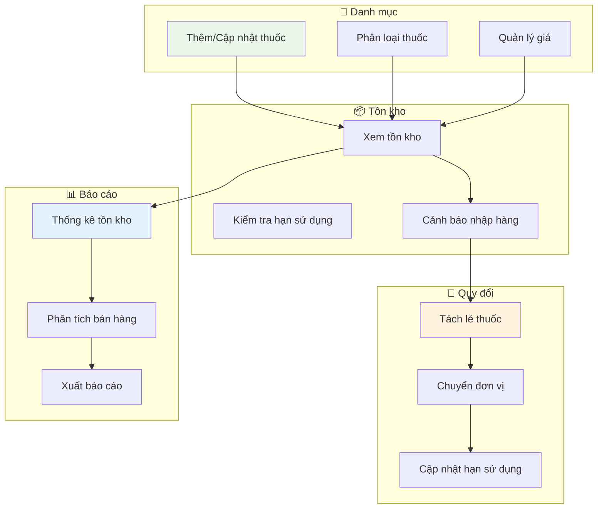

# Hướng dẫn quản lý Thuốc và Tồn kho

## Tổng quan

Module này bao gồm các API quản lý danh mục thuốc, tồn kho, phân loại, và quy đổi lô thuốc.

## 1. Thuoc API - Quản lý danh mục thuốc

### Các endpoint chính

#### 1.1 Lấy danh sách thuốc

**GET** `/api/Thuoc`

**Response (thành công):**
```json
{
  "status": 0,
  "message": "Success",
  "data": [
    {
      "maThuoc": "THUOC001",
      "tenThuoc": "Paracetamol",
      "maLoaiThuoc": "LOAI001",
      "tenLoaiThuoc": "Thuốc giảm đau",
      "moTa": "Thuốc giảm đau, hạ sốt",
      "hinhAnh": "paracetamol.jpg",
      "trangThai": true
    }
  ]
}
```

#### 1.2 Lấy thông tin thuốc theo ID

**GET** `/api/Thuoc/{maThuoc}`

#### 1.3 Lấy giá thuốc theo mã thuốc

**GET** `/api/Thuoc/{maThuoc}/GiaThuocs`

#### 1.4 Lấy danh sách loại đơn vị

**GET** `/api/Thuoc/LoaiDonVi`

#### 1.5 Lấy top loại thuốc

**GET** `/api/Thuoc/TopLoaiThuoc`

#### 1.6 Lấy danh sách thuốc tồn kho

**GET** `/api/Thuoc/ListThuocTonKho`

#### 1.7 Lấy thuốc theo loại (tồn kho)

**GET** `/api/Thuoc/ByLoaiTonKho/{maLoaiThuoc}`

#### 1.8 Lấy thuốc theo loại

**GET** `/api/Thuoc/ByLoai/{maLoaiThuoc}`

#### 1.9 Thêm thuốc mới

**POST** `/api/Thuoc`

**Request Body (FormData):**
```
tenThuoc: Paracetamol
maLoaiThuoc: LOAI001
moTa: Thuốc giảm đau, hạ sốt
hinhAnh: [file] (optional)
trangThai: true
```

#### 1.10 Cập nhật thuốc

**PUT** `/api/Thuoc/{id}`

#### 1.11 Xóa thuốc

**DELETE** `/api/Thuoc/{id}`

## 2. ThuocView API - Xem tồn kho theo trạng thái

### Các endpoint chính

#### 2.1 Lấy danh sách thuốc chưa tách lẻ

**GET** `/api/ThuocView/ChuaTachLe`

**Response (thành công):**
```json
[
  {
    "maLo": "LO001",
    "maThuoc": "THUOC001",
    "tenThuoc": "Paracetamol",
    "donViGoc": "HOP",
    "tenLoaiDonViGoc": "Hộp",
    "soLuongCon": 50,
    "hanSuDung": "2025-12-31T00:00:00",
    "trangThaiSeal": false,
    "ghiChu": "Lô nhập mới"
  }
]
```

#### 2.2 Lấy danh sách thuốc đã tách lẻ

**GET** `/api/ThuocView/DaTachLe`

#### 2.3 Lấy tổng số lượng còn theo thuốc

**GET** `/api/ThuocView/TongSoLuongCon`

## 3. NhomLoai API - Quản lý phân loại thuốc

### Các endpoint chính

#### 3.1 Lấy danh sách tất cả nhóm loại

**GET** `/api/NhomLoai`

#### 3.2 Lấy thông tin nhóm loại theo mã

**GET** `/api/NhomLoai/{maNhom}`

#### 3.3 Lấy danh sách loại theo nhóm

**GET** `/api/NhomLoai/Loai/{maNhom}`

#### 3.4 Lấy nhóm loại kèm thông tin loại

**GET** `/api/NhomLoai/WithLoai`

## 4. PhieuQuyDoi API - Quản lý quy đổi lô

### Các endpoint chính

#### 4.1 Tạo phiếu quy đổi hàng loạt

**POST** `/api/PhieuQuyDoi/Create`

**Request Body:**
```json
{
  "items": [
    {
      "maThuoc": "THUOC001",
      "soLuongGoc": 100
    }
  ]
}
```

#### 4.2 Quy đổi nhanh theo mã thuốc

**POST** `/api/PhieuQuyDoi/QuickByMa`

## Ví dụ sử dụng từ frontend

### JavaScript / Fetch API

```javascript
// Lấy danh sách thuốc
const thuocList = await fetch('/api/Thuoc');
const thuocData = await thuocList.json();

// Lấy thuốc tồn kho
const tonKho = await fetch('/api/Thuoc/ListThuocTonKho');
const tonKhoData = await tonKho.json();

// Lấy thuốc chưa tách lẻ
const chuaTachLe = await fetch('/api/ThuocView/ChuaTachLe');
const chuaTachLeData = await chuaTachLe.json();

// Lấy nhóm loại
const nhomList = await fetch('/api/NhomLoai');
const nhomData = await nhomList.json();

// Quy đổi lô thuốc
const quyDoiData = {
  items: [
    {
      maThuoc: "THUOC001",
      soLuongGoc: 100
    }
  ]
};

const quyDoiResponse = await fetch('/api/PhieuQuyDoi/Create', {
  method: 'POST',
  headers: {
    'Content-Type': 'application/json'
  },
  body: JSON.stringify(quyDoiData)
});

// Thêm thuốc mới
const formData = new FormData();
formData.append('tenThuoc', 'Aspirin');
formData.append('maLoaiThuoc', 'LOAI001');
formData.append('moTa', 'Thuốc giảm đau');
formData.append('trangThai', 'true');

const addResponse = await fetch('/api/Thuoc', {
  method: 'POST',
  body: formData
});
```

## Flow Diagrams

### 1. 💊 Luồng Quản lý Danh mục Thuốc

```mermaid
flowchart TD
    A[👨‍💼 Quản lý thuốc] --> B{💡 Muốn làm gì?}
    B -->|👀 Xem danh sách| C[📋 GET /api/Thuoc]
    B -->|🔍 Xem chi tiết| D[💊 GET /api/Thuoc/{id}]
    B -->|💰 Xem giá| E[💵 GET /api/Thuoc/{id}/GiaThuocs]
    B -->|➕ Thêm mới| F[📝 Nhập thông tin thuốc]
    B -->|✏️ Cập nhật| G[💊 Chọn thuốc cần sửa]
    B -->|🗑️ Xóa| H[💊 Chọn thuốc cần xóa]
    C --> I[🗄️ Database]
    D --> I
    E --> I
    F --> J[📤 POST /api/Thuoc]
    G --> K[📤 PUT /api/Thuoc/{id}]
    H --> L[📤 DELETE /api/Thuoc/{id}]
    J --> M[🔍 Validate dữ liệu]
    K --> M
    L --> N[🔍 Kiểm tra tồn kho]
    M --> O{✅ Hợp lệ?}
    O -->|❌ Không| P[⚠️ Báo lỗi]
    O -->|✅ Có| Q[🏷️ Generate mã thuốc]
    Q --> R[💾 Lưu database]
    R --> S[✅ Thành công]
    N --> T{📦 Còn tồn kho?}
    T -->|✅ Có| U[⚠️ Không thể xóa]
    T -->|❌ Không| V[🗑️ Xóa thuốc]
    V --> S
    I --> W[📊 Trả dữ liệu]
    W --> X[💻 Hiển thị]
    S --> X
    P --> Y[💻 Hiển thị lỗi]
    U --> Y
```

### 2. 📦 Luồng Xem Tồn kho

```mermaid
flowchart TD
    A[👨‍💼 Nhân viên kho] --> B{💡 Muốn xem gì?}
    B -->|📦 Tất cả tồn kho| C[📋 GET /api/Thuoc/ListThuocTonKho]
    B -->|🔍 Theo loại| D[🏷️ Chọn loại thuốc]
    B -->|📋 Chưa tách lẻ| E[📦 GET /api/ThuocView/ChuaTachLe]
    B -->|🔢 Đã tách lẻ| F[📦 GET /api/ThuocView/DaTachLe]
    B -->|📊 Tổng hợp| G[📊 GET /api/ThuocView/TongSoLuongCon]
    D --> H[📤 GET /api/Thuoc/ByLoaiTonKho/{maLoai}]
    C --> I[🗄️ Query tồn kho]
    H --> I
    E --> I
    F --> I
    G --> I
    I --> J{📦 Có dữ liệu?}
    J -->|❌ Không| K[📭 Không có hàng]
    J -->|✅ Có| L[📊 Hiển thị danh sách]
    L --> M[👆 Click xem chi tiết]
    M --> N[📋 Chi tiết lô thuốc]
    N --> O[📅 Xem hạn sử dụng]
    O --> P[🔢 Kiểm tra số lượng]
    P --> Q{⚠️ Sắp hết?}
    Q -->|✅ Sắp hết| R[📢 Cảnh báo nhập hàng]
    Q -->|❌ Còn nhiều| S[✅ OK]
    K --> T[💻 Hiển thị thông báo]
    R --> U[📝 Tạo phiếu nhập]
    S --> V[📊 Báo cáo tồn kho]
```

### 3. 🏷️ Luồng Quản lý Phân loại Thuốc

```mermaid
flowchart TD
    A[👨‍💼 Quản lý danh mục] --> B{💡 Quản lý gì?}
    B -->|📁 Nhóm thuốc| C[📂 GET /api/NhomLoai]
    B -->|🏷️ Loại thuốc| D[🏷️ GET /api/NhomLoai/Loai/{maNhom}]
    B -->|📊 Nhóm + Loại| E[📊 GET /api/NhomLoai/WithLoai]
    C --> F[🗄️ Database]
    D --> F
    E --> F
    F --> G[📋 Hiển thị danh sách]
    G --> H[👆 Click xem chi tiết]
    H --> I[📋 Chi tiết nhóm/loại]
    I --> J[📝 Chỉnh sửa]
    J --> K[💾 Lưu thay đổi]
    K --> L[✅ Cập nhật thành công]
    L --> G
```

### 4. 🔄 Luồng Quy đổi Lô Thuốc



### 5. 📈 Luồng Phân tích và Báo cáo Thuốc

```mermaid
flowchart TD
    A[👨‍💼 Quản lý] --> B{💡 Muốn phân tích gì?}
    B -->|📊 Top loại thuốc| C[📈 GET /api/Thuoc/TopLoaiThuoc]
    B -->|📦 Thuốc tồn kho| D[📦 GET /api/Thuoc/ListThuocTonKho]
    B -->|🏷️ Theo loại| E[🏷️ GET /api/Thuoc/ByLoaiTonKho/{maLoai}]
    B -->|📋 Tất cả thuốc| F[📋 GET /api/Thuoc]
    C --> G[🗄️ Query & thống kê]
    D --> G
    E --> G
    F --> G
    G --> H[📊 Xử lý dữ liệu]
    H --> I[📈 Tạo biểu đồ]
    I --> J[📊 Xuất báo cáo]
    J --> K[🖨️ In báo cáo]
    K --> L[📧 Gửi email]
    L --> M[✅ Hoàn thành]
```

### 6. 🔄 Tổng quan Quy trình Quản lý Thuốc



## Lưu ý kỹ thuật

### Thuoc API:
- Upload hình ảnh: Sử dụng FormData cho POST/PUT
- Mã thuốc: Tự động generate khi tạo
- Giá thuốc: Có lịch sử giá qua bảng GiaThuoc
- Tồn kho: Tính từ bảng TonKho
- Trạng thái: true = active, false = inactive

### ThuocView API:
- TrangThaiSeal: false = chưa tách lẻ, true = đã tách lẻ
- Chỉ hiển thị lô có SoLuongCon > 0
- Join với bảng Thuoc để lấy tên thuốc

### NhomLoai API:
- Mã nhóm (maNhom): Unique identifier
- Quan hệ: Nhóm chứa nhiều Loại

### PhieuQuyDoi API:
- Mã phiếu quy đổi: Tự động generate
- Mã lô mới: Tự động generate cho mỗi lô được tạo

## Test API

### Sử dụng Swagger UI
1. Chạy: `dotnet run --launch-profile "https"`
2. Mở: `https://localhost:port/swagger`
3. Tìm endpoints trong `Thuoc`, `ThuocView`, `NhomLoai`, `PhieuQuyDoi`

### Sử dụng PowerShell

```powershell
# Lấy danh sách thuốc
Invoke-WebRequest -Uri "https://localhost:5001/api/Thuoc" -Method GET -SkipCertificateCheck

# Lấy thuốc tồn kho
Invoke-WebRequest -Uri "https://localhost:5001/api/Thuoc/ListThuocTonKho" -Method GET -SkipCertificateCheck

# Lấy thuốc chưa tách lẻ
Invoke-WebRequest -Uri "https://localhost:5001/api/ThuocView/ChuaTachLe" -Method GET -SkipCertificateCheck

# Lấy nhóm loại
Invoke-WebRequest -Uri "https://localhost:5001/api/NhomLoai" -Method GET -SkipCertificateCheck

# Quy đổi lô
$quyDoiBody = @{
    items = @(
        @{
            maThuoc = "THUOC001"
            soLuongGoc = 100
        }
    )
} | ConvertTo-Json

Invoke-WebRequest -Uri "https://localhost:5001/api/PhieuQuyDoi/Create" -Method POST -Body $quyDoiBody -ContentType "application/json" -SkipCertificateCheck
```

## Hỗ trợ

Kiểm tra logs server nếu gặp lỗi. Đảm bảo:
- maLoaiThuoc/maNhom tồn tại khi reference
- File hình ảnh hợp lệ (nếu upload)
- Không xóa thuốc đang có tồn kho
- Quan hệ khóa ngoại được thiết lập đúng